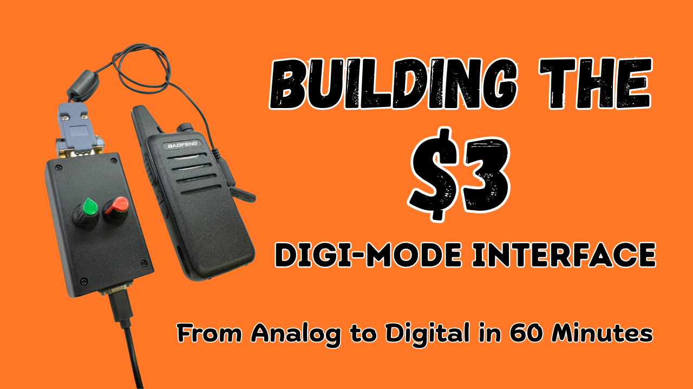

# Building the $3 DIGI-MODE Interface

This is the companion repository the the Youtube video showing the build of the $3 digi-mode radio interface.

## Schematic

- [PDF: schematic.pdf](<schematic.pdf>)
- [KiCAD: schematic.kicad_sch](<schematic.kicad_sch>)

## "Kantronisc" Connection Diagram

- [PDF: kantronisc-connection-diagram.pdf](<kantronisc-connection-diagram.pdf>)
- [draw.io: kantronisc-connection-diagram.drawio](<kantronisc-connection-diagram.drawio>)

## PTT Buffer

- [PDF: ptt-buffer.pdf](<ptt-buffer.pdf>)
- [draw.io: ptt-buffer.drawio](<ptt-buffer.drawio>)

## Bill of Material

These are the parts I used for my build; pretty much everything except the CM108 USB sound card is an optional extra.

- CM108 USB Sound Card
- DB9 (DE9) Connector
- USB-C Connector
- 2 x 10KΩ Potentiometer
- 2N2222 NPN Transistor (or equivalent)
- 2 x 10pF Electrolytic Capacitor
- 1kΩ Resistor
- 10kΩ Resistor
- Enclosure

## Build Pictures

I know the solder joints look like shit - I was going for quick and functional, not pretty!

